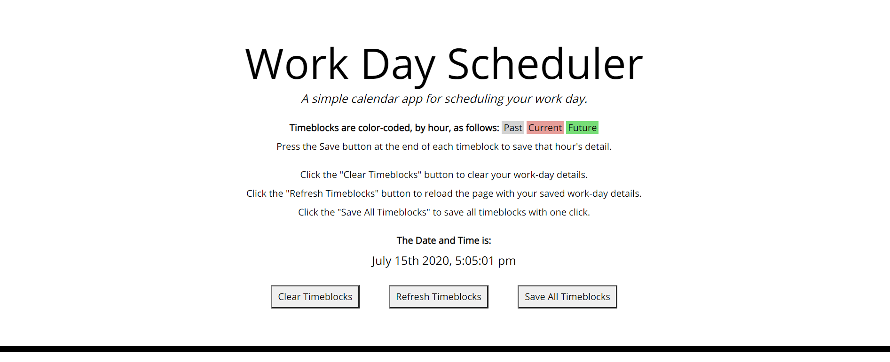
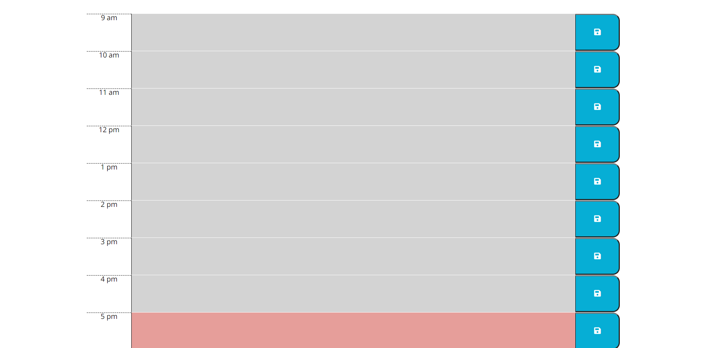

This application is a simple scheduler for a 9-5 work day.  Its basic functionality is to enter your hourly details into the input fields and then clicking the save button to store them into your browser's local storage.  Upon reloading the page, your details will populate (loading the page retrieves your data from local storage) into the input field for view or edits.

Upon loading the page, the date and time at that moment are displayed, retrieving data from moment.js.  The timeblocks are color-coded (described on the app page) depending on the current hour .

Additionally provided are buttons that:  
    -Clear all timeblocks on the page and in local storage.  
    -Refresh the page.  
    -Save all timeblocks in one click.

https://raytieu.github.io/day-planner/

